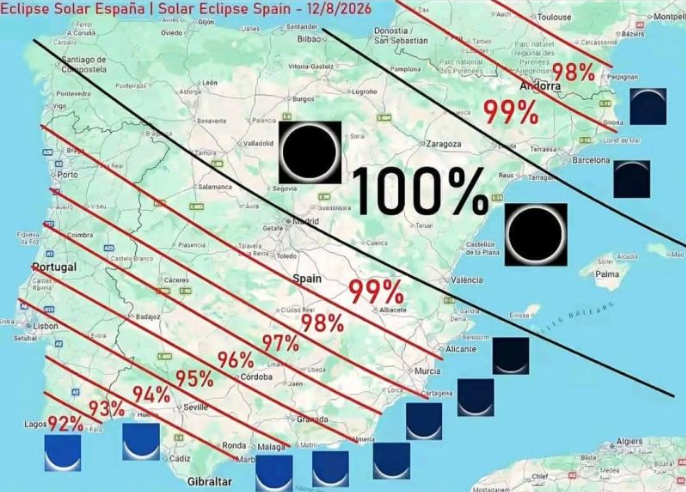

<div align="center">

# 🛰️🌑 Análisis de Imágenes de Satélite Sentinel-2,Eclipse Solar : 12 de Agosto 2026

</div>

Autora: Lavinia Bacaru (@codinglavinia)<br>
Fecha de comienzo del proyecto: 11 de Agosto de 2026<br>
Ubicación: España — Península Ibérica<br>
Estado: 🚧 En desarrollo

##  Descripción del Proyecto:

Este proyecto realiza un análisis geoespacial detallado del impacto del eclipse solar total del **12 de agosto de 2026 en España**, utilizando imágenes de satélite **Sentinel-2** y **QGIS** como herramientas de procesamiento de datos geoespaciales.

---

</div>



## 🎯 Objetivos:

* ✅ Descargar imágenes Sentinel-2 de alta resolución (**10 m**) de la zona de España
* ✅ Procesar datos brutos en **QGIS** mediante composites RGB y falso color
* ✅ Analizar la cobertura de nubes y cambios atmosféricos durante la totalidad
* ✅ Crear visualizaciones comparativas (**pre-eclipse vs. post-eclipse**)
* ✅ Exportar datos en formatos **GeoJSON / GeoTIFF** para aplicaciones web
* ✅ Construir un **dashboard interactivo** con React + Leaflet
* ✅ Documentar todo el flujo de trabajo en GitHub
---
## 🔬 Metodología :

<div align="center">

<p><strong>🛰️ Selección de datos Sentinel-2</strong></p>

<p>⬇️</p>

<p><strong>☁️ Control de calidad y nubosidad</strong></p>

<p>⬇️</p>

<p><strong>⚙️ Preprocesamiento de imágenes</strong></p>

<p>⬇️</p>

<p><strong>🎨 Composites RGB / Falso Color</strong></p>

<p>⬇️</p>

<p><strong>📊 Cálculo de índices espectrales</strong></p>

<p>⬇️</p>

<p><strong>🌑 Análisis Pre-Eclipse / Eclipse / Post-Eclipse</strong></p>

<p>⬇️</p>

<p><strong>🗺️ Procesamiento y visualización en QGIS</strong></p>

<p>⬇️</p>

<p><strong>📦 Exportación GeoTIFF / GeoJSON</strong></p>

<p>⬇️</p>

<p><strong>🌐 Visualización web con React + Leaflet</strong></p>

</div>


## 📁 Estructura del Proyecto:

```text
eclipse-sentinel2-analysis/
│
│
├── data/
│   ├── raw/                           # Imágenes RAW Sentinel-2 
│   │   ├── 2026-08-11_S2_pre/
│   │   ├── 2026-08-12_S2_eclipse/
│   │   └── 2026-08-13_S2_post/
│   │
│   └── processed/                     # Datos procesados
│       ├── eclipse_pre.tif
│       ├── eclipse_eclipse.tif
│       ├── eclipse_post.tif
│       ├── cloud_cover.geojson
│       └── eclipse_path.geojson
│
├── qgis_workflows/
│   ├── eclipse_analysis.qgz            # Proyecto QGIS (workspace)
│   ├── band_composite_script.py        # Script PyQGIS para composites
│   └── cloud_detection_algorithm.py    # Algoritmo de detección de nubes
│
├── scripts/
│   ├── download_sentinel2.py           # Script de descarga de datos
│   ├── preprocess_imagery.py           # Procesamiento de imágenes
│   ├── calculate_ndci.py               # Cálculo de índices espectrales
│   └── export_geojson.py               # Exportar a formatos web
│
├── visualization/
│   ├── dashboard/
│   │   ├── package.json
│   │   ├── src/
│   │   │   ├── App.jsx
│   │   │   ├── components/
│   │   │   │   ├── MapComponent.jsx
│   │   │   │   ├── ComparisonSlider.jsx
│   │   │   │   └── CloudAnalytics.jsx
│   │   │   └── styles/
│   │   └── public/
│   │
│   └── maps/
│       ├── eclipse_coverage.html
│       └── cloud_analysis.html
│
├── docs/
│   ├── WORKFLOW.md
│   ├── QGIS_TUTORIAL.md
│   ├── CLOUD_DETECTION.md
│   └── RESULTS.md
```

---

## 🌍 Recursos y referencias :

### 🛰️ Descargar imagenes satelitales

* **Copernicus Sentinel-2 Hub:**
  https://dataspace.copernicus.eu/


### 📚 Para la documentación Técnica:

* [Documentación QGIS](https://qgis.org/documentation/)
* [Rasterio Documentation](https://rasterio.readthedocs.io/)
* [GeoPandas Documentation](https://geopandas.org/)
* [Leaflet Documentation](https://leafletjs.com/)

### 🔬 Artículos Científicos :

* *Remote Sensing of Solar Eclipses* — Astrophysics Review
* *Cloud Detection Algorithms for Sentinel-2* — ISPRS Journal

---

## Agradecimientos :

🛰️ **ESA / Copernicus** :Imágenes Sentinel-2 <br>
🗺️ **Comunidad QGIS** : https://qgis.org/community <br>
🇪🇸 **Comunidad GIS de España** :https://www.qgis.es <br>
✈️ **Telegram QGIS España** : https://t.me/qgis_es


---

</div>
